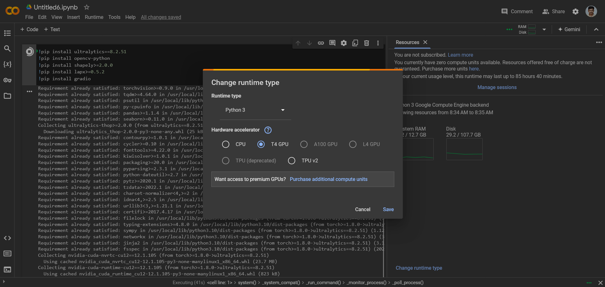
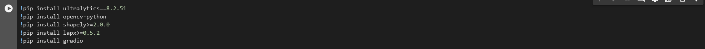
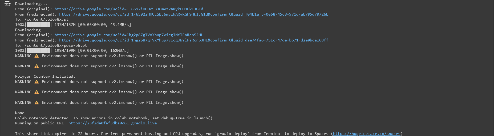
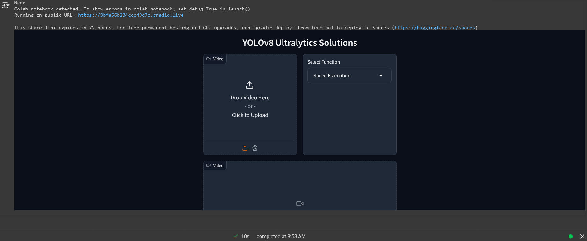
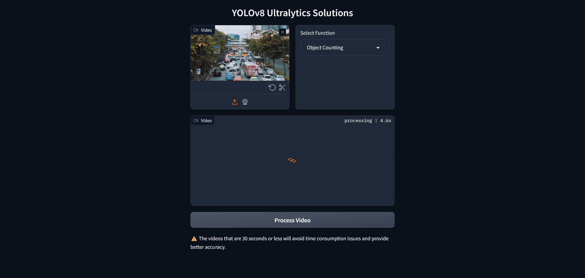
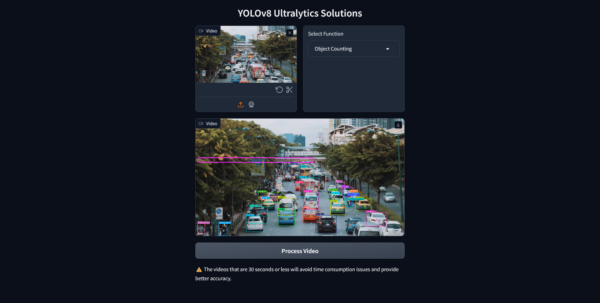

## Ultralytics 8.2.51 YOLOv8 in Colab Demo 🍺

    Ultralytics dropped the YOLOv8 - #Ultralytics 8.2.51 🔥, YOLOv8 is designed to be fast, accurate, and easy to use, making it an excellent choice for a wide range of object detection and tracking, instance segmentation, image classification and pose estimation tasks.

☑️ Seamless Real-Time Object Detection: Streamlit combined with YOLOv8 enables real-time object detection directly from your webcam feed. This allows for immediate analysis and insights, making it ideal for applications requiring instant feedback.
☑️Efficient Resource Utilization: YOLOv8 optimized algorithm ensure high-speed processing with minimal computational resources.

    from ultralytics import solutions
    solutions.inference()
    ### Make sure to run the file using command `streamlit run <file-name.py>`

👉🏻Official Documentation:
Ultralytics YOLOv8 Documentation: Refer to the official YOLOv8 documentation for comprehensive guides and insights on various computer vision tasks and projects. 🔗 https://docs.ultralytics.com/ .

## Make Sure that Runtime Type is T4 GPU

## Ensure to all requirement types

## After running all the moudules the Gradio app is live

## Upload the Video to Infer

## The resultant Video Processing

## The Outcome of Video Processing

## Demo Video 

.

.

.@prithivsakthiur
